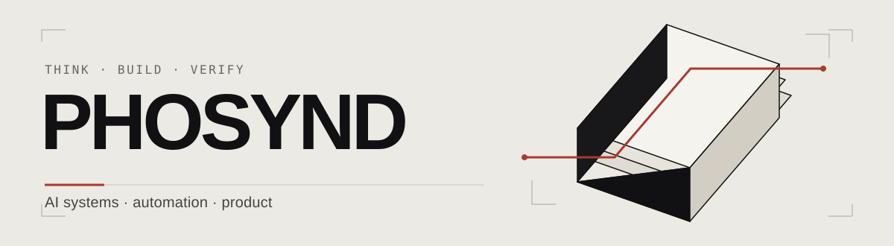

I’m **Phosynd (최관혁)**. I turn ambiguous work into systems people can use—through clear problem definitions, AI agent orchestration, and careful verification.

**[Portfolio ↗](https://www.phosynd.com/en/)** · **[한국어 포트폴리오](https://www.phosynd.com/)** · **[LinkedIn](https://www.linkedin.com/in/kwanhyeok-choi-3b02a342b/)** · **[Contact](mailto:phosynd@gmail.com)**

### How I work

- **Frame the problem.** Understand where the work breaks down before choosing a tool.
- **Orchestrate the work.** Give people, AI, and automation distinct responsibilities.
- **Verify the outcome.** Check what actually happened, and keep evidence separate from inference.

### Selected work

| Project | My contribution |
| :--- | :--- |
| **[AI Video Feedback](https://www.phosynd.com/en/work/ai-feedback)** | Designed, built, and operated a workflow connecting video understanding with quality review and feedback delivery. |
| **[Creator Operations Data](https://www.phosynd.com/en/work/creator-data)** | Reconciled inconsistent records and turned missing or outdated information into usable team data. |
| **[Gorda](https://www.phosynd.com/en/work/gorda)** | Owned data, AI, and server-side work for a product that helps people compare new and used laptops. |
| **[PANTHEON](https://www.phosynd.com/en/work/pantheon)** | Organized an AI team around one human operator, one coordinator, and seven specialist roles. |

A few measured outcomes: **1,109 feedback messages delivered to 927 creators** over two weeks, and **139,292 data rows reconciled**. The linked case studies explain the dates, scope, and my role.

**Tools I work with:** Python · SQL · JavaScript · Claude Code · Codex

---

### 한국어

안녕하세요, **최관혁 / Phosynd**입니다. 문제를 구조화하고, AI와 자동화의 역할을 나누고, 실제 결과로 검증하는 일을 합니다. 새로운 도구를 붙이는 것보다, 사람이 믿고 사용할 수 있는 업무와 제품을 만드는 데 관심이 있습니다.

[포트폴리오에서 문제·판단·역할·성과를 확인하실 수 있습니다.](https://www.phosynd.com/)
